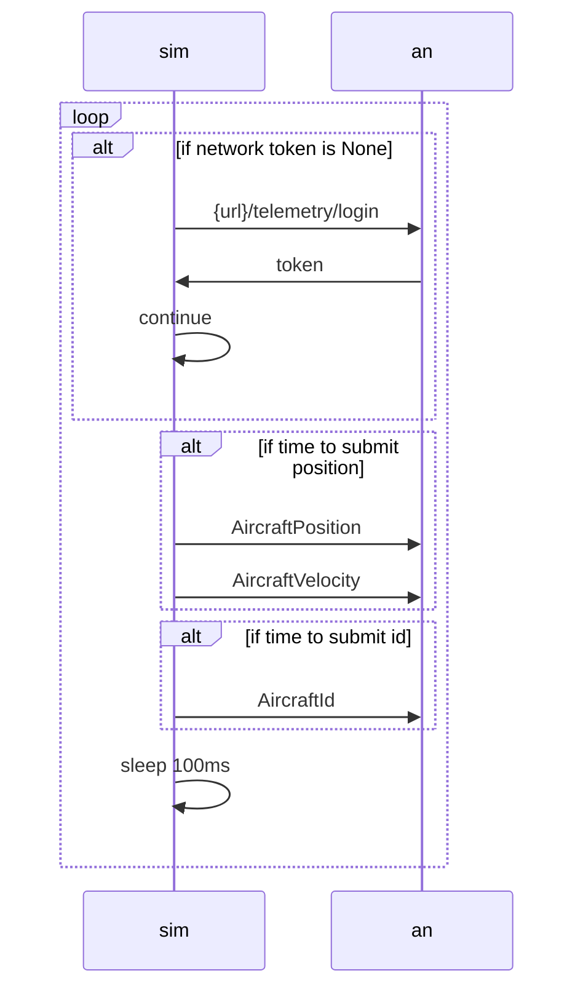

# Carrier Simulation

Simulates an aircraft movement and answer/reply with the backend.

```mermaid

sequenceDiagram
    loop
        alt if network token is None
            sim->>an: {url}/telemetry/login
            an->>sim: token
            sim->>sim: continue
        end

        alt if time to submit position
            sim->>an: AircraftPosition
            sim->>an: AircraftVelocity
        end

        alt if time to submit id
            sim->>an: AircraftId
        end

        sim->>sim: sleep 100ms
    end

```