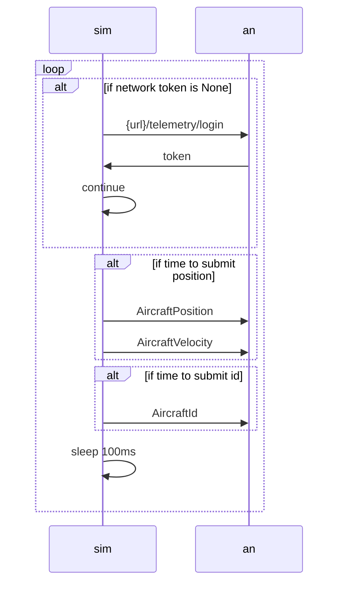

# Carrier Simulation

## Installation

```bash
# in another directory outside of this repo
git clone https://github.com/PX4/PX4-Autopilot.git --recursive
git clone https://github.com/mavlink/qgroundcontrol --recursive

# build qgroundcontrol
cd qgroundcontrol
docker build --file ./deploy/docker/Dockerfile-build-linux -t qgc-linux-docker .
mkdir build .cache
docker run --rm \
    -v ${PWD}:/project/source \
    -v ${PWD}/build:/project/build \
    -v ${PWD}/.cache:/.cache \
    --user $(id -u):$(id -g) \
    qgc-linux-docker

# edit local .env file to update PX4_AUTOPILOT_DIR=/path/to/PX4-Autopilot
# edit local .env file to update QGC_DIR=/path/to/qgroundcontrol

# (optional) to use NVIDIA hardware
# https://docs.nvidia.com/datacenter/cloud-native/container-toolkit/latest/install-guide.html#installing-with-apt
# https://docs.nvidia.com/datacenter/cloud-native/container-toolkit/latest/install-guide.html#configuring-docker

# in this directory
# TODO Makefile target
docker build -t sim-carrier .
docker pull
mkdir .px4 .qgc .gazebo # or else permissions issues

USER_ID=$(id -u) GID=$(id -g) docker compose up px4
```

See [common installation errors](#common-installation-errors) in the appendix.

## Overview 

Simulates an aircraft movement and answer/reply with the backend.



# Appendix

## Common Installation Errors

### Build Git Version Header

This attempts to build a header file, in doing so it calls a couple of git commands.

The git command doesn't like being called in directories not owned by the caller, resulting in a 128 error.

```bash
FAILED: src/lib/version/build_git_version.h 
sim-carrier-px4  | cd /src/PX4-Autopilot && /usr/bin/python3 /src/PX4-Autopilot/src/lib/version/px_update_git_header.py /src/PX4-Autopilot/build/px4_sitl_default/src/lib/version/build_git_version.h --validate
sim-carrier-px4  | Traceback (most recent call last):
sim-carrier-px4  |   File "/src/PX4-Autopilot/src/lib/version/px_update_git_header.py", line 124, in <module>
sim-carrier-px4  |     mavlink_git_version = subprocess.check_output('git rev-parse --verify HEAD'.split(),
sim-carrier-px4  |   File "/usr/lib/python3.8/subprocess.py", line 415, in check_output
sim-carrier-px4  |     return run(*popenargs, stdout=PIPE, timeout=timeout, check=True,
sim-carrier-px4  |   File "/usr/lib/python3.8/subprocess.py", line 516, in run
sim-carrier-px4  |     raise CalledProcessError(retcode, process.args,
sim-carrier-px4  | subprocess.CalledProcessError: Command '['git', 'rev-parse', '--verify', 'HEAD']' returned non-zero exit status 128.
```
