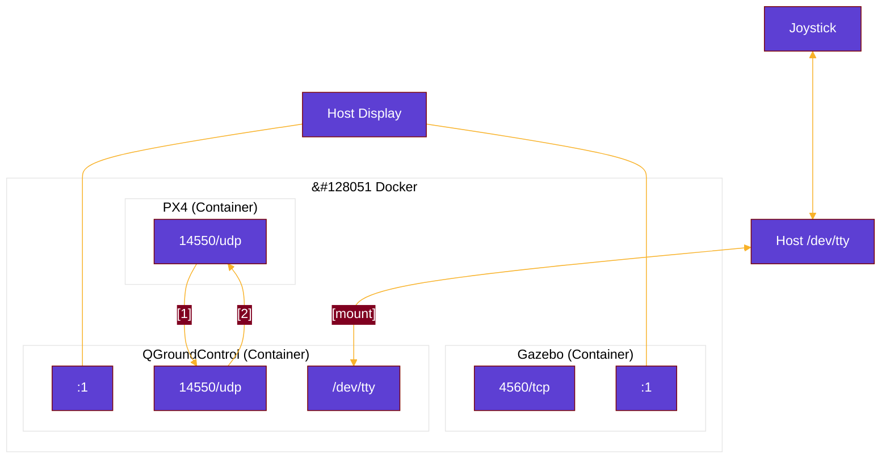

# :dove: Carrier Simulation

## :hammer: Installation

```bash
# in another directory outside of this repo
git clone -b v1.14.3 https://github.com/PX4/PX4-Autopilot.git --recursive

# in another directory outside of this repo, build qgroundcontrol
git clone -b StableV4.2 https://github.com/mavlink/qgroundcontrol --recursive
cd qgroundcontrol
docker build --file ./deploy/docker/Dockerfile-build-ubuntu -t qgc-linux-docker .
mkdir build .cache
docker run --rm \
    --user $(id -u):$(id -g) \
    -v ${PWD}:/project/source \
    -v ${PWD}/build:/project/build \
    -v ${PWD}/.cache:/.cache \
    qgc-linux-docker

# in this directory
make setup # generates a new .env file and required folders

# edit local .env file to update PX4_AUTOPILOT_DIR=/path/to/PX4-Autopilot
# NOTICE! Running px4 with docker compose in this repository will make changes
#  to certain files in your PX4_AUTOPILOT_DIR. Please be aware of this and be on
#  a clean branch or dedicated directory.

# edit local .env file to update QGC_DIR=/path/to/qgroundcontrol

# Don't need to do this yet, commented out for the time being
# docker build -t sim-carrier .
# docker compose pull

USER_ID=$(id -u) GROUP_ID=$(id -g) docker compose up px4
```

To use NVIDIA hardware (optional):
- [Install NVIDIA Dependencies](https://docs.nvidia.com/datacenter/cloud-native/container-toolkit/latest/install-guide.html#installing-with-apt)
- [Configure Docker to Use NVIDIA Driver](https://docs.nvidia.com/datacenter/cloud-native/container-toolkit/latest/install-guide.html#configuring-docker)

## :telescope: Overview 

### [`docker-compose.yaml`](docker-compose.yaml)

The following services are launched with docker compose:
- Gazebo
    - Robot physics simulation.
    - A rotorcraft model is loaded into a 3D world with simulated sensor data.
- PX4 Autopilot (SITL)
    - Drone flight software.
    - Stabilization, GPS follow, precision landing, and more.
    - Instead of in flight hardware, we will be running PX4 software-in-the-loop (SITL). 
    - Will subscribe to the sensor messages from Gazebo and believe it's actually flying in real world environment.
- QGroundControl
    - Send MAVLINK messages to the aircraft (PX4 Autopilot).
    - Define flight plans (waypoints, takeoff/landing coordinates, etc.) and upload them to aircraft.
    - Pre-flight checklists, aircraft sensor calibration, arming/disarming aircraft.
    - Joystick

The connections are illustrated below:



#### Downsides of Dockerization

Typically QGroundControl, Gazebo, and PX4 Autopilot (SITL) are run together on the same host. In fact, the recommended way to run PX4 with Gazebo is a PX4 Makefile target which launches both together.

However, we decided to run PX4 in a separate container to eventually take advantage of the `deploy: replicas:` feature of docker compose. This will deploy multiple simulated aircraft while Gazebo is launched once in a separate container.

Since we have taken this path, these programs are no longer sharing a localhost. `docker compose up px4` will, during initialization, edit some files in the local PX4-Autopilot repository to replace hardcoded (or implied) references to 'localhost'. This will point PX4 to the proper static IP addresses[^staticip] for the Gazebo and QGC containers.

[^staticip]: Static IP addresses are used because the scripts in PX4-Autopilot will not expand hostnames.

