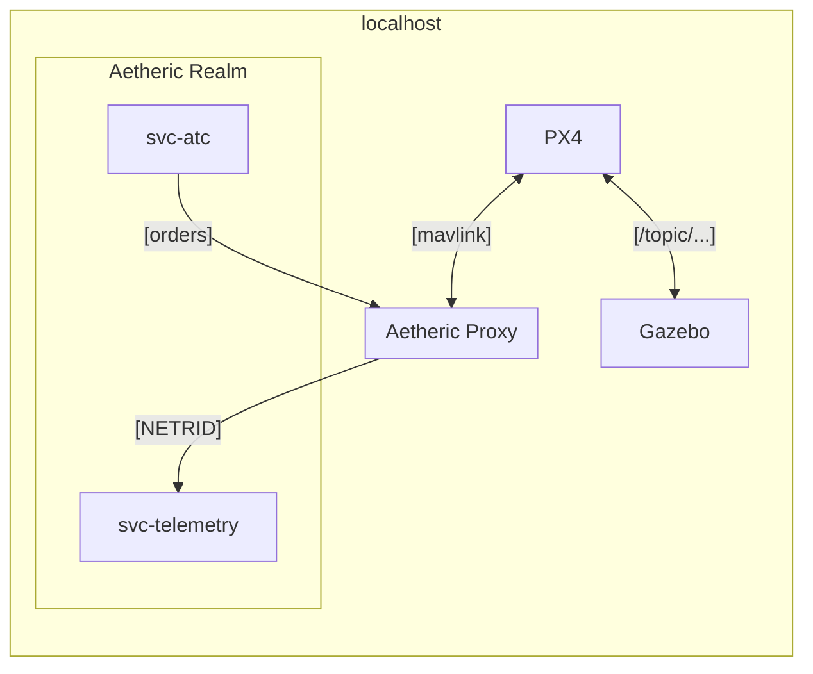
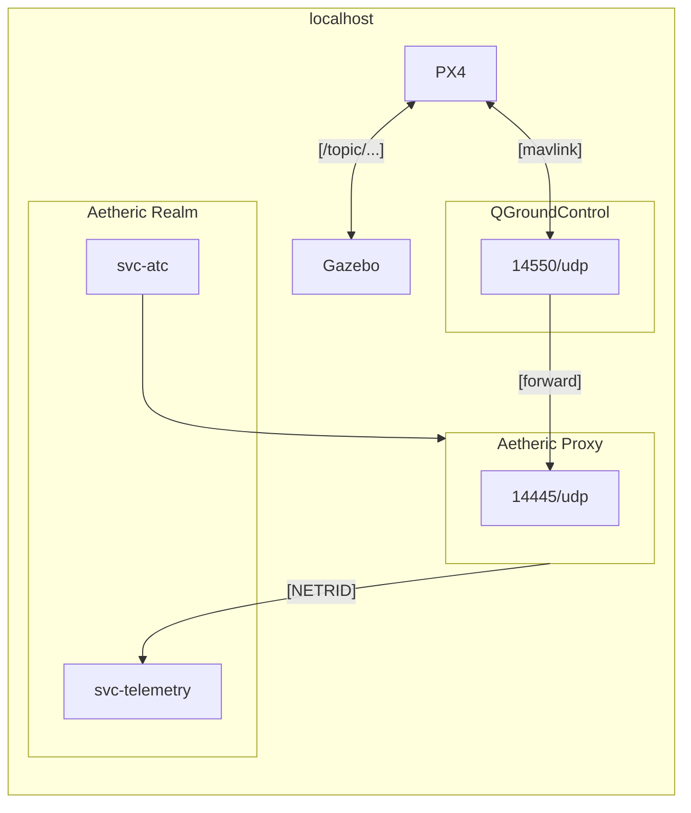
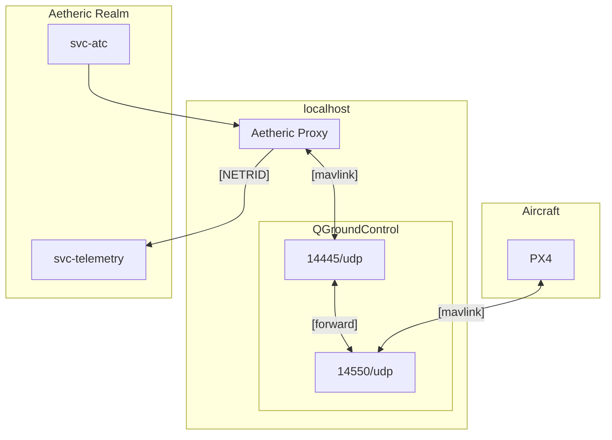
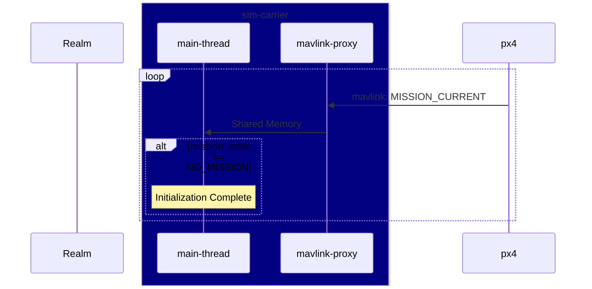
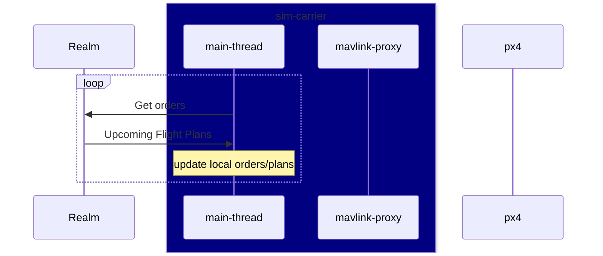
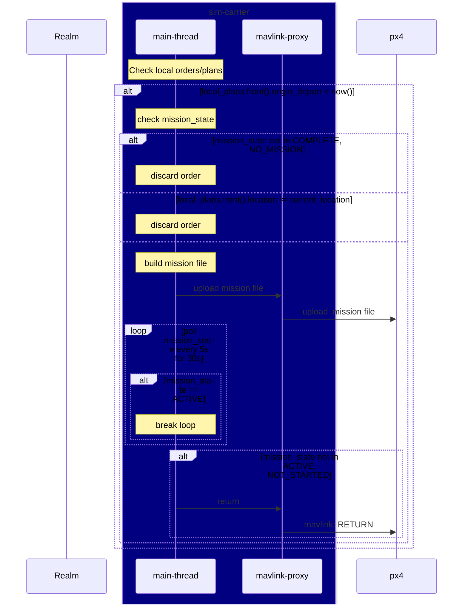

# :dove: PX4 Proxy

## :hammer: Installation from Source

Tested on:
- Ubuntu 22.04 (Jammy)

Requires quite a bit of setup:
```bash
make setup # creates needed directories, copies .env.repo to .env

sudo apt-get install gz-harmonic

# in another directory outside of this repo, build qgroundcontrol
git clone -b Stable_V4.2 https://github.com/mavlink/qgroundcontrol --recursive
cd qgroundcontrol
docker build --file ./deploy/docker/Dockerfile-build-ubuntu -t qgc-linux-docker .
mkdir build .cache
docker run --rm \
    --user $(id -u):$(id -g) \
    -v ${PWD}:/project/source \
    -v ${PWD}/build:/project/build \
    -v ${PWD}/.cache:/.cache \
    qgc-linux-docker

# in another directory outside of this repo
git clone -b v1.14.3 https://github.com/PX4/PX4-Autopilot.git --recursive
cd PX4-Autopilot
make px4_sitl

# for this repo
cd sim-carrier
make rust-build
```

Additionally the full set of Realm services need to be running. The `REALM_HOST` and `*_PORT_REST` variables in `.env` should be set to the correct address.

To launch the Realm services locally:
```bash
git clone https://github.com/arrow-air/tools.git
cd tools/local-dev
cp .env-example .env

# can update the .env image names and tags to 'IMAGE=svc-example; TAG=latest'
# for any services you've built locally, otherwise they will be pulled
# from the ghcr.io container registry

docker compose up svc-discovery # launches disco, telem, gis, and storage
# or 'docker compose up' with no further arguments to launch all services
```

## :hammer: Launch from Source

Terminal Window #1:
```bash
cd PX4-Autopilot
make px4_sitl gz_x500
# starts the PX4 software, spawns a detached Gazebo session
```

Terminal Window #2:
```bash
cd sim-carrier
# NOTE: .env file
# if you want to use mavlink passthrough from QGC, set UDP_PORT to 14445
# if you want to get mavlink directly from the PX4 instance, set UDP_PORT to 14550, and don't launch qgroundcontrol
# the instance number will start from '0' and increment with the number of PX4 instances
# one sim-carrier per px4 instance
./target/debug/sim-carrier --px4 {instance number}
# starts the PX4 software, spawns a detached Gazebo session
```

Terminal Window #3:
```bash
cd qgroundcontrol
./build/staging/QGroundControl
# On first startup, go to Application Settings > MAVLink
# and enable MAVLink Forwarding @ localhost:14445
``` 


## :telescope: Overview 

### Involved Software

- Gazebo
    - Robot physics simulation.
    - A rotorcraft model is loaded into a 3D world with simulated sensor data.
- PX4 Autopilot (SITL)
    - Drone flight software.
    - Stabilization, GPS follow, precision landing, and more.
    - Instead of in flight hardware, we will be running PX4 software-in-the-loop (SITL). 
    - Will subscribe to the sensor messages from Gazebo and believe it's actually flying in real world environment.
- QGroundControl
    - Send MAVLINK messages to the aircraft (PX4 Autopilot).
    - Define flight plans (waypoints, takeoff/landing coordinates, etc.) and upload them to aircraft.
    - Pre-flight checklists, aircraft sensor calibration, arming/disarming aircraft.
    - Joystick
- Aetheric PX4 Proxy (this)
    - Offboard conversion of mavlink telemetry to Remote ID messages
    - Stores the aircraft's current state, obtained through Mavlink messages
    - Forwards new Aetheric orders in a manner the drone can understand
- Aetheric Realm
    - Backend for Aetheric services

#### Illustrated: With Simulation (no QGC)

If you set the UDP_PORT to 14550, QGC will not be involved. sim-carrier will receive MAVlink directly from the PX4 instance.


```mermaid
flowchart LR
    subgraph localhost
        gazebo["Gazebo"]

        px4["PX4"]

        subgraph proxy["Aetheric Proxy"]
        end

        subgraph realm["Aetheric Realm"]
            svc-telemetry
            svc-atc
        end

        px4 <--[/topic/...]--> gazebo
        px4 <--[mavlink]--> proxy
        proxy --[NETRID]--> svc-telemetry
        svc-atc --[orders]--> proxy
    end 
```


#### Illustrated: With Simulation & QGroundControl

NOTE: This setup is unidirectional, mavlink will be forwarded to the Aetheric proxy only. The proxy will not be able to issue mavlink orders directly to the PX4 instance.


```mermaid
flowchart LR
    subgraph localhost
        gazebo["Gazebo"]

        px4["PX4"]

        subgraph qgc["QGroundControl"]
            qgc-14550["14550/udp"]
        end

        subgraph proxy["Aetheric Proxy"]
            qgc-mavlink-forward["14445/udp"]
        end

        subgraph realm["Aetheric Realm"]
            svc-telemetry
            svc-atc
        end

        qgc-14550 --[forward]--> qgc-mavlink-forward
        px4 <--[/topic/...]--> gazebo
        px4 <--[mavlink]--> qgc-14550

        proxy --[NETRID]--> svc-telemetry
        svc-atc --> proxy
    end 
```


#### Illustrated: Realworld Deployment


```mermaid
flowchart TB
    subgraph localhost
        subgraph qgc["QGroundControl"]
            qgc-14550["14550/udp"]
            qgc-mavlink-forward["14445/udp"]
            qgc-mavlink-forward <--[forward]--> qgc-14550
        end

        subgraph proxy["Aetheric Proxy"]
        end

        proxy <--[mavlink]--> qgc-mavlink-forward
    end 

    subgraph Aircraft
        px4["PX4"]
    end

    subgraph realm["Aetheric Realm"]
        svc-telemetry
        svc-atc
    end

    px4 <--[mavlink]--> qgc-14550
    proxy --[NETRID]--> svc-telemetry
    svc-atc --> proxy
```

### :email: Communication Flow

#### Initialization

We start the proxy with the expectation that the drone is not currently in a mission.

This means waiting until the previous mission completes, and transitions to NO_MISSION after the plan is dropped from memory.

The `mavlink-proxy` thread will continue after initialization to save the `MISSION_CURRENT` state into shared memory (whenever it is received). The main thread will have access at all times through a threadsafe mutex.


```mermaid
sequenceDiagram;

participant realm as Realm

box navy sim-carrier
    participant main as main-thread
    participant proxy as mavlink-proxy
end

participant px4

loop
    px4 ->> proxy: mavlink: MISSION_CURRENT
    proxy ->> main: Shared Memory

    alt mission_state == NO_MISSION
        Note over main: Initialization Complete
    end
end
```

#### Await Orders Loop

This loop runs even while a mission is active. It simply updates the docket of upcoming missions that an aircraft will participate in.


```mermaid
sequenceDiagram;

participant realm as Realm

box navy sim-carrier
    participant main as main-thread
    participant proxy as mavlink-proxy
end

participant px4

loop 
    main ->> realm: Get orders
    realm ->> main: Upcoming Flight Plans
    Note over main: update local orders/plans
end
```

#### Mission Upload Procedure

For the sake of a demonstration environment, if a drone is not finished with its current mission before the start of the new one, we will cancel the new one.

For an extra layer of safety, the aircraft's current reported position needs to match the starting location for the plan.


```mermaid
sequenceDiagram;

participant realm as Realm

box navy sim-carrier
    participant main as main-thread
    participant proxy as mavlink-proxy
end

participant px4

Note over main: Check local orders/plans
alt local_plans.front().origin_depart < now()
    Note over main: check mission_state
    alt mission_state not in COMPLETE, NO_MISSION
        Note over main: discard order
    else local_plans.front().location != current_location
        Note over main: discard order
    else
        Note over main: build mission file
        main ->> proxy: upload mission file
        proxy ->> px4: upload .mission file
        loop poll mission_state every 5s for 30s
            alt mission_state == ACTIVE
                NOTE over main: break loop
            end
        end
        alt mission_state not in ACTIVE, NOT_STARTED
            main ->> proxy: return
            proxy ->> px4: mavlink: RETURN
        end
    end
end
```